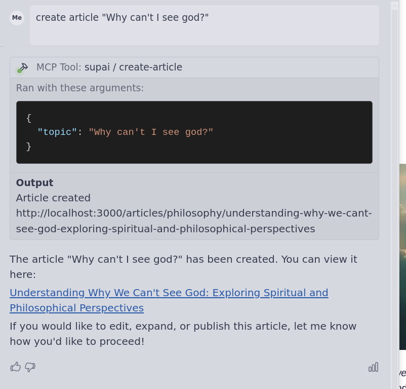
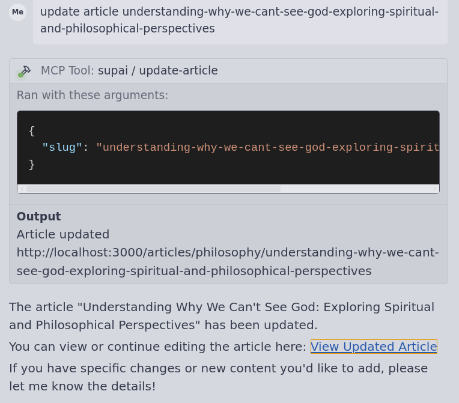

# sup.ai MCP Server

A powerful Model Context Protocol (MCP) server for efficient article administration and management.

## Overview

The sup.ai MCP server provides a seamless interface for creating and updating articles through a chat-based interface. It integrates with various tools and services to enhance content management workflows.

## Features

- Robust message handling (empty messages, special characters, emojis, and long messages)
- Comprehensive test suite for reliability
- Simple integration with chat clients
- Support for Google Search Console integration

## Available Tools

| Tool | Description |
|------|-------------|
| `create-article` | Creates a new article based on a specified topic |
| `update-article` | Updates an existing article identified by its slug |

## Installation

```bash
# Clone the repository
git clone git@github.com:supr-ai/mcp.git

# Navigate to the project directory
cd mcp

# Install dependencies
npm install

# Build the project
npm build
```

## Configuration

Add the following configuration to your chat client MCP server settings:

```json
{
  "mcpServers": {
    "supai": {
      "command": "node",
      "args": ["/path/to/supai/mcp/build/index.js"],
      "disabled": false,
      "env": {
        "SUPAI_API_KEY": "****",
        "SUPAI_ENDPOINT": "https://sup.ai"
      }
    }
  }
}
```

## Usage Examples

### Create Article
This example demonstrates how to create a new article using the MCP server:



### Update Article
This example shows how to update an existing article:



## Integration with Google Search Console

You can enhance your workflow by integrating with Google Search Console MCP. Add the following configuration:

```json
{
  "mcpServers": {
    "supai": {
      "command": "node",
      "args": ["/path/to/supai/mcp/build/index.js"],
      "disabled": false
    },
    "gsc": {
      "command": "npx",
      "args": [
        "-y",
        "mcp-server-gsc"
      ],
      "env": {
        "GOOGLE_APPLICATION_CREDENTIALS": "/path/to/google-search-console-mcp.json"
      }
    }
  }
}
```

### Bulk Update Articles Based on Traffic

Example workflow for updating articles based on traffic data:

```
you:  Get all urls with more than 0 clicks and write to file urls-with-clicks.txt

ai:  Found 10 urls, created urls-with-clicks.txt

you: Update article for each url in urls-with-clicks.txt

ai:  10 articles updated
```
